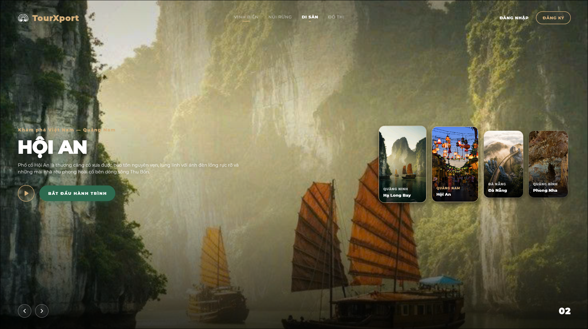
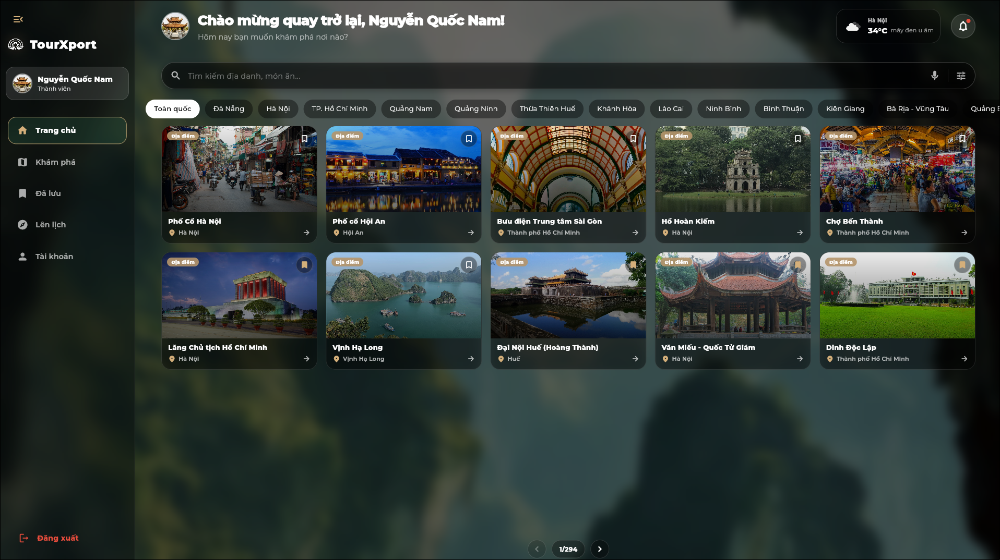
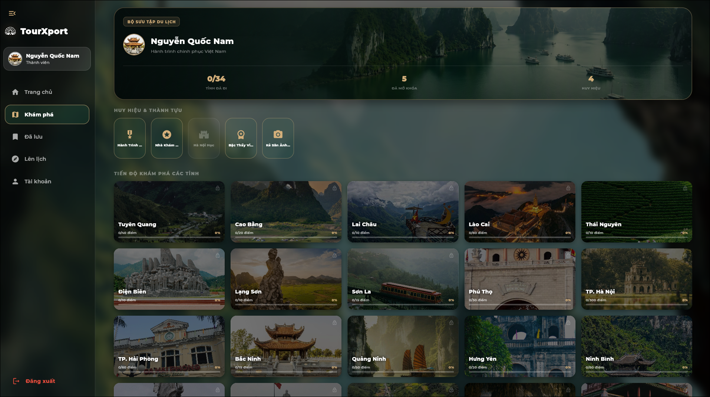
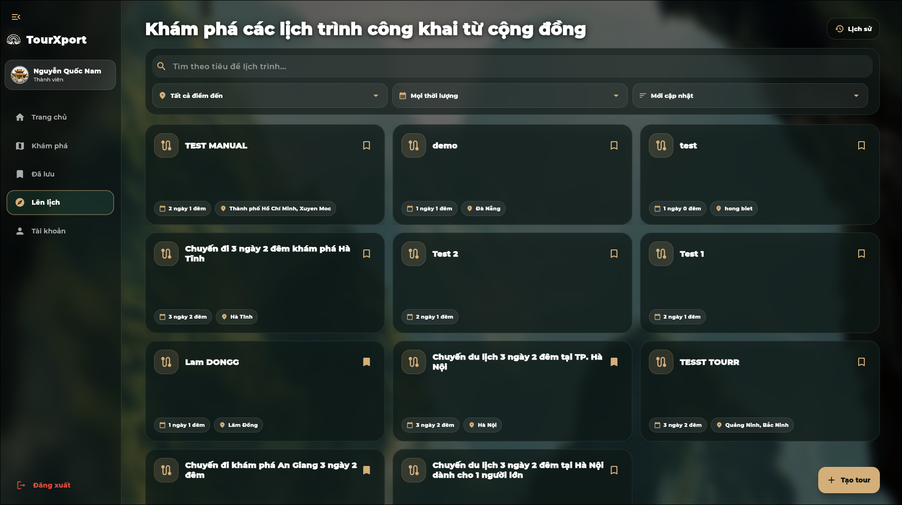
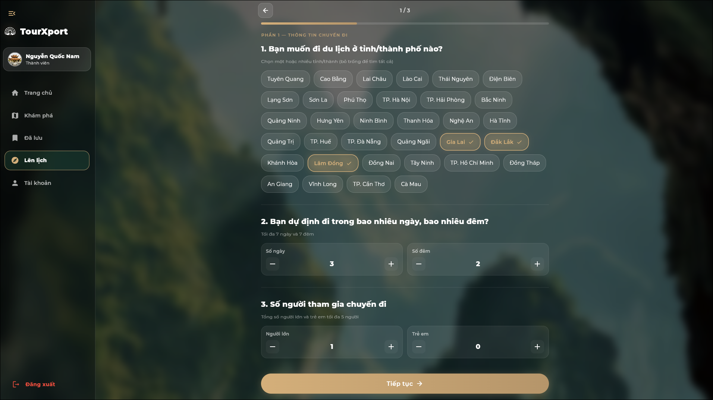
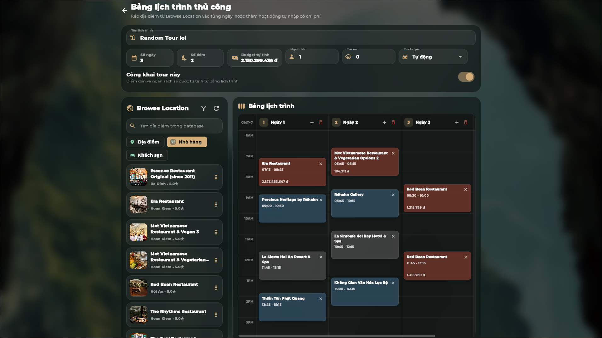
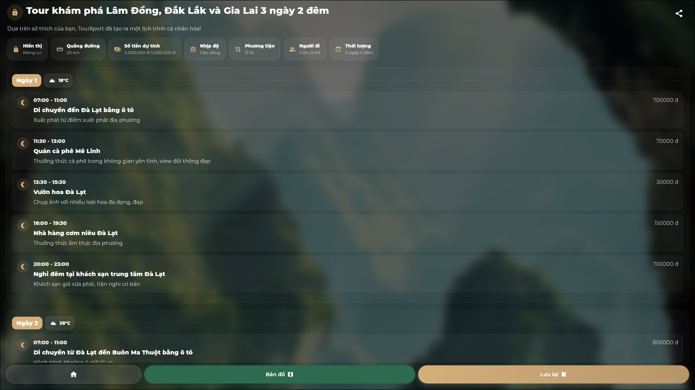
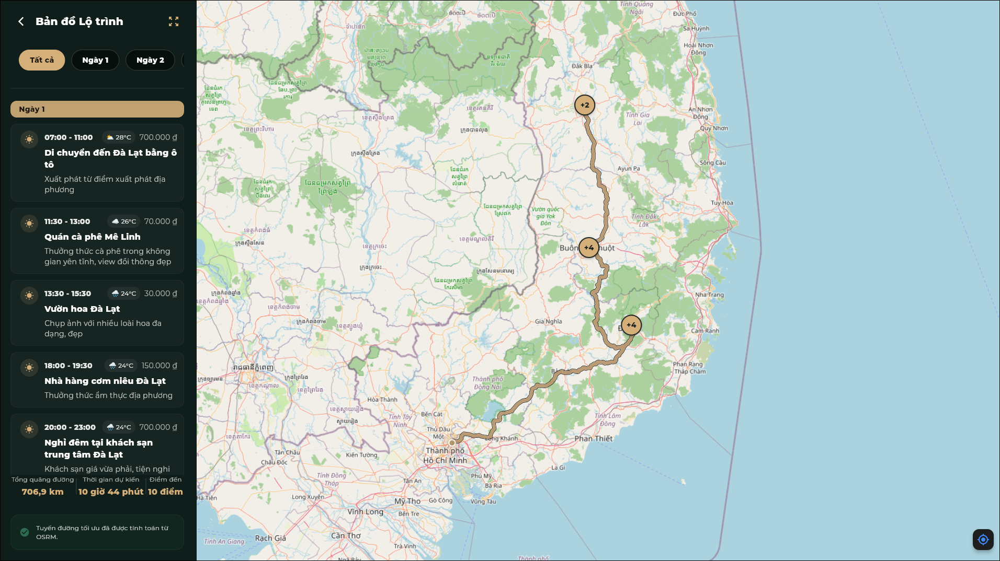
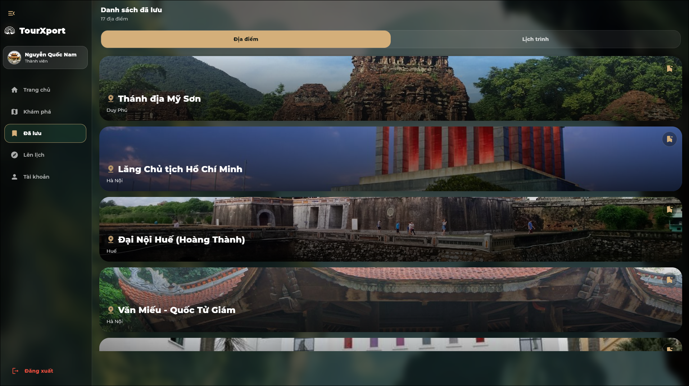
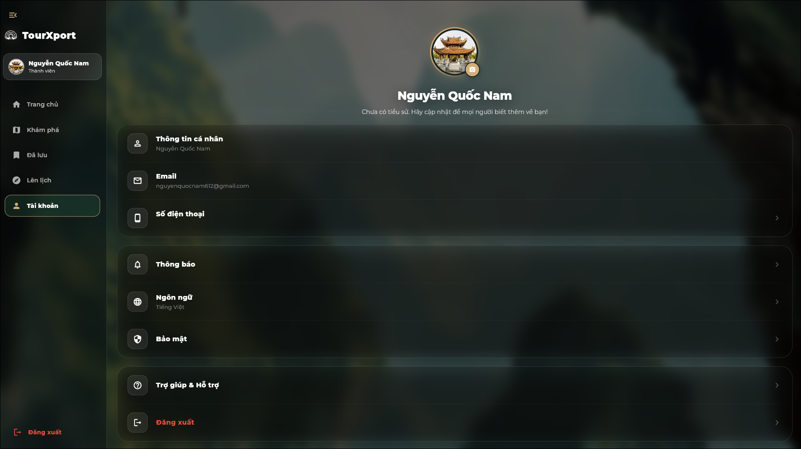

<p align="center">
  
</p>

<h1 align="center">TourXport</h1>

<p align="center">
  AI-assisted travel planning for Vietnam, built with Flutter, Node.js, FastAPI, MongoDB, and map/routing services.
</p>

<p align="center">
  Một ứng dụng du lịch thông minh kết hợp Trí tuệ Nhân tạo để tự động hóa việc lập kế hoạch chuyến đi từ A-Z.
</p>

<p align="center">
  <a href="https://github.com/quocnam612/TourXport/stargazers"></a>
  <a href="https://github.com/quocnam612/TourXport/network/members"></a>
  <a href="LICENSE"></a>
</p>

<p align="center">
  
  
  
  
  
  
</p>

<p align="center">
  <a href="https://github.com/quocnam612/TourXport/releases">
    
  </a>
  <a href="https://github.com/quocnam612/TourXport/releases">
    
  </a>
</p>

<p align="center">
  <strong>Supported Platforms</strong><br>
  
  
  
  
</p>

<p align="center">
  <a href="#english">English</a> |
  <a href="#tiếng-việt">Tiếng Việt</a>
</p>

---

## English

TourXport is a cross-platform travel planning application that helps users discover places, restaurants, hotels, and generate personalized itineraries. The application combines a Flutter client, a Node.js API server, a Python AI backend, MongoDB-backed tourism data, route calculation, weather data, and authentication integrations.

The project was developed as an academic software project for Computational Thinking at the University of Science, VNU-HCM.

### Live Demo

- Web app: [https://tourxport.vercel.app](https://tourxport.vercel.app)
- Repository: [https://github.com/quocnam612/TourXport](https://github.com/quocnam612/TourXport)

### Key Features

- AI itinerary generation based on destination, budget, trip length, travelers, interests, and pace.
- Manual itinerary board with drag-and-drop planning.
- Place, restaurant, and hotel discovery backed by a MongoDB dataset.
- Saved places and saved tours.
- Reviews, user accounts, Google/Discord login, and profile security settings.
- Interactive route map with routing, distance, duration, and weather context.
- Responsive Flutter UI for Web, Android, Windows, and Linux builds.

### Screenshots

#### Desktop / Web

<table>
  <tr>
    <td width="50%" align="center">
      <br>
      <sub>Landing Page</sub>
    </td>
    <td width="50%" align="center">
      <br>
      <sub>Home Page</sub>
    </td>
  </tr>
  <tr>
    <td width="50%" align="center">
      <br>
      <sub>Explore Page</sub>
    </td>
    <td width="50%" align="center">
      <br>
      <sub>Tours Page</sub>
    </td>
  </tr>
  <tr>
    <td width="50%" align="center">
      <br>
      <sub>AI Tour Maker</sub>
    </td>
    <td width="50%" align="center">
      <br>
      <sub>Manual Tour Maker</sub>
    </td>
  </tr>
  <tr>
    <td width="50%" align="center">
      <br>
      <sub>Tour Detail</sub>
    </td>
    <td width="50%" align="center">
      <br>
      <sub>Tour Map</sub>
    </td>
  </tr>
  <tr>
    <td width="50%" align="center">
      <br>
      <sub>Saved Page</sub>
    </td>
    <td width="50%" align="center">
      <br>
      <sub>Account Page</sub>
    </td>
  </tr>
</table>

### Architecture

| Component | Path | Responsibility |
| --- | --- | --- |
| Flutter client | `frontend/` | Cross-platform UI, itinerary screens, maps, account flows, saved items, and local app state. |
| Node.js backend | `backend/` | Main REST API, authentication, users, saved tours, reviews, location APIs, routing proxy/orchestration. |
| Python AI backend | `ai_backend/` | AI itinerary generation, RAG-style database context, and support chatbot logic. |
| Crawler/data utilities | `crawler/` | Data collection and enrichment scripts for tourism content. |
| Docker Compose | `docker-compose.yml` | Local orchestration for Node.js backend and Python AI backend. |

Default local ports:

| Service | URL |
| --- | --- |
| Node.js backend | `http://localhost:3000` |
| AI backend | `http://localhost:8000` |
| Flutter Web | `http://localhost:7357` when using `frontend/run_web.sh` |

### Prerequisites

Install the following tools:

- Git
- Docker and Docker Compose
- Flutter SDK
- Chrome or another Flutter-supported browser for web development
- Android Studio / Android SDK if you want to run Android builds

You also need API keys and service credentials for the features you want to test. At minimum, itinerary generation requires MongoDB and OpenAI configuration.

### Environment Setup

Create a local environment file from the example:

```bash
cp .env.example .env
```

Then update `.env` with your credentials:

```env
JWT_KEY=replace_with_a_long_random_secret
MONGO_URI=mongodb+srv://<username>:<password>@cluster0.xxxxx.mongodb.net/tourxport?appName=Cluster0
OPENAI_API_KEY=sk-your_openai_api_key
OPENROUTESERVICE_API_KEY=your_openrouteservice_api_key
OPENWEATHERMAP_API_KEY=your_openweathermap_api_key
GOOGLE_CLIENT_ID=your-google-web-client-id.apps.googleusercontent.com
DISCORD_CLIENT_ID=your_discord_client_id
DISCORD_CLIENT_SECRET=your_discord_client_secret
```

Optional integrations:

- Cloudinary keys are used for uploaded/profile media workflows.
- RapidAPI keys are used by crawler utilities.
- `PORT_BACKEND`, `PORT_AI`, `WEB_HOST`, and `WEB_PORT` can override local development ports.

### Run Locally

#### 1. Start backend services

From the repository root:

```bash
docker compose up --build backend ai_backend
```

This starts:

- Node.js API server at `http://localhost:3000`
- Python AI backend at `http://localhost:8000`

To run in the background:

```bash
docker compose up -d --build backend ai_backend
```

To stop services:

```bash
docker compose down
```

#### 2. Start Flutter Web

Open another terminal:

```bash
cd frontend
flutter pub get
./run_web.sh
```

The web app will run at:

```text
http://localhost:7357
```

The script reads `.env` from the repository root and passes these values into Flutter:

- `API_BASE_URL`
- `AI_BASE_URL`
- `GOOGLE_CLIENT_ID`
- `DISCORD_CLIENT_ID`

If you prefer to run Flutter manually:

```bash
cd frontend
flutter pub get
flutter run -d chrome \
  --web-hostname localhost \
  --web-port 7357 \
  --dart-define API_BASE_URL=http://localhost:3000 \
  --dart-define AI_BASE_URL=http://localhost:8000
```

#### 3. Run Android

Connect an Android device or start an emulator, then run:

```bash
cd frontend
flutter pub get
./run_android.sh
```

Or manually:

```bash
cd frontend
flutter run -d <device-id> \
  --dart-define API_BASE_URL=http://<your-lan-ip>:3000 \
  --dart-define AI_BASE_URL=http://<your-lan-ip>:8000
```

For physical Android devices, avoid `localhost` because it points to the phone itself. Use your computer's LAN IP address.

### Build

#### Web

```bash
cd frontend
./build_web.sh
```

#### Android APK

```bash
cd frontend
./build_apk.sh
```

### Useful Commands

```bash
# Backend logs
docker compose logs -f backend

# AI backend logs
docker compose logs -f ai_backend

# Rebuild only the AI backend
docker compose up -d --build ai_backend

# Rebuild only the Node.js backend
docker compose up -d --build backend

# Check running containers
docker compose ps
```

### Project Structure

```text
TourXport/
├── ai_backend/          # Python FastAPI AI service
├── backend/             # Node.js Express API service
├── crawler/             # Data crawler and enrichment utilities
├── external/            # README/demo screenshots
├── frontend/            # Flutter application
├── report/              # Project report assets/documents
├── docker-compose.yml   # Local backend orchestration
├── .env.example         # Environment variable template
└── README.md
```

### Troubleshooting

- If Flutter cannot connect to the backend, verify `API_BASE_URL` and `AI_BASE_URL`.
- If Android cannot connect to local services, use your computer's LAN IP instead of `localhost`.
- If itinerary generation fails, check `OPENAI_API_KEY`, `MONGO_URI`, and AI backend logs.
- If map routing fails, verify `OPENROUTESERVICE_API_KEY`.
- If weather widgets fail, verify `OPENWEATHERMAP_API_KEY`.
- If Docker uses stale code, rebuild the service with `docker compose up -d --build <service>`.

### Contributing

Contributions are welcome. Please open an issue for bugs or feature requests, and keep pull requests focused on one logical change at a time.

### License

This project is licensed under the terms in [LICENSE](LICENSE).

---

## Tiếng Việt

TourXport là ứng dụng lập kế hoạch du lịch đa nền tảng, giúp người dùng khám phá địa điểm, nhà hàng, khách sạn và tạo lịch trình cá nhân hóa bằng AI. Hệ thống kết hợp Flutter, Node.js, FastAPI, MongoDB, dữ liệu bản đồ, định tuyến, thời tiết và đăng nhập người dùng.

Dự án được phát triển trong bối cảnh môn học Tư duy tính toán tại Trường Đại học Khoa học Tự nhiên, ĐHQG-HCM.

### Demo

- Web app: [https://tourxport.vercel.app](https://tourxport.vercel.app)
- Repository: [https://github.com/quocnam612/TourXport](https://github.com/quocnam612/TourXport)

### Tính năng chính

- Tạo lịch trình bằng AI dựa trên điểm đến, ngân sách, số ngày, số người, sở thích và nhịp độ.
- Bảng tạo tour thủ công hỗ trợ kéo thả địa điểm.
- Khám phá địa điểm, nhà hàng, khách sạn từ dữ liệu MongoDB.
- Lưu địa điểm và lưu tour.
- Đánh giá, tài khoản người dùng, đăng nhập Google/Discord và thiết lập bảo mật cá nhân.
- Bản đồ tương tác với tuyến đường, khoảng cách, thời gian di chuyển và thời tiết.
- Giao diện Flutter responsive cho Web, Android, Windows và Linux.

### Kiến trúc

| Thành phần | Thư mục | Vai trò |
| --- | --- | --- |
| Flutter client | `frontend/` | Giao diện đa nền tảng, lịch trình, bản đồ, tài khoản, lưu địa điểm/tour. |
| Node.js backend | `backend/` | REST API chính, xác thực, người dùng, tour, review, location API và điều phối routing. |
| Python AI backend | `ai_backend/` | Sinh lịch trình bằng AI, xử lý ngữ cảnh dữ liệu và chatbot hỗ trợ. |
| Crawler/data utilities | `crawler/` | Script thu thập và làm giàu dữ liệu du lịch. |
| Docker Compose | `docker-compose.yml` | Chạy local backend Node.js và AI backend. |

Port mặc định khi chạy local:

| Dịch vụ | URL |
| --- | --- |
| Backend Node.js | `http://localhost:3000` |
| AI backend | `http://localhost:8000` |
| Flutter Web | `http://localhost:7357` khi dùng `frontend/run_web.sh` |

### Yêu cầu cài đặt

Cần cài sẵn:

- Git
- Docker và Docker Compose
- Flutter SDK
- Chrome hoặc trình duyệt được Flutter hỗ trợ
- Android Studio / Android SDK nếu muốn chạy Android

Bạn cũng cần các API key tương ứng. Tối thiểu để tạo lịch trình AI cần cấu hình MongoDB và OpenAI.

### Cấu hình môi trường

Tạo file `.env` từ file mẫu:

```bash
cp .env.example .env
```

Cập nhật các biến quan trọng:

```env
JWT_KEY=replace_with_a_long_random_secret
MONGO_URI=mongodb+srv://<username>:<password>@cluster0.xxxxx.mongodb.net/tourxport?appName=Cluster0
OPENAI_API_KEY=sk-your_openai_api_key
OPENROUTESERVICE_API_KEY=your_openrouteservice_api_key
OPENWEATHERMAP_API_KEY=your_openweathermap_api_key
GOOGLE_CLIENT_ID=your-google-web-client-id.apps.googleusercontent.com
DISCORD_CLIENT_ID=your_discord_client_id
DISCORD_CLIENT_SECRET=your_discord_client_secret
```

Các tích hợp tùy chọn:

- Cloudinary dùng cho luồng upload media/profile.
- RapidAPI dùng cho các script crawler.
- Có thể đổi port bằng `PORT_BACKEND`, `PORT_AI`, `WEB_HOST`, `WEB_PORT`.

### Tự chạy local

#### 1. Chạy backend

Tại thư mục gốc của repo:

```bash
docker compose up --build backend ai_backend
```

Lệnh này chạy:

- Node.js API tại `http://localhost:3000`
- Python AI backend tại `http://localhost:8000`

Chạy nền:

```bash
docker compose up -d --build backend ai_backend
```

Dừng service:

```bash
docker compose down
```

#### 2. Chạy Flutter Web

Mở terminal khác:

```bash
cd frontend
flutter pub get
./run_web.sh
```

Ứng dụng web chạy tại:

```text
http://localhost:7357
```

Script sẽ đọc `.env` ở thư mục gốc và truyền các giá trị sau vào Flutter:

- `API_BASE_URL`
- `AI_BASE_URL`
- `GOOGLE_CLIENT_ID`
- `DISCORD_CLIENT_ID`

Nếu muốn chạy thủ công:

```bash
cd frontend
flutter pub get
flutter run -d chrome \
  --web-hostname localhost \
  --web-port 7357 \
  --dart-define API_BASE_URL=http://localhost:3000 \
  --dart-define AI_BASE_URL=http://localhost:8000
```

#### 3. Chạy Android

Kết nối thiết bị Android hoặc mở emulator:

```bash
cd frontend
flutter pub get
./run_android.sh
```

Hoặc chạy thủ công:

```bash
cd frontend
flutter run -d <device-id> \
  --dart-define API_BASE_URL=http://<your-lan-ip>:3000 \
  --dart-define AI_BASE_URL=http://<your-lan-ip>:8000
```

Với điện thoại thật, không dùng `localhost` vì nó trỏ về chính điện thoại. Hãy dùng IP LAN của máy tính đang chạy backend.

### Build

#### Web

```bash
cd frontend
./build_web.sh
```

#### Android APK

```bash
cd frontend
./build_apk.sh
```

### Lệnh hữu ích

```bash
# Xem log backend
docker compose logs -f backend

# Xem log AI backend
docker compose logs -f ai_backend

# Rebuild riêng AI backend
docker compose up -d --build ai_backend

# Rebuild riêng Node.js backend
docker compose up -d --build backend

# Kiểm tra container đang chạy
docker compose ps
```

### Xử lý lỗi thường gặp

- Flutter không gọi được backend: kiểm tra `API_BASE_URL` và `AI_BASE_URL`.
- Android không gọi được service local: dùng IP LAN của máy tính thay vì `localhost`.
- Tạo lịch trình lỗi: kiểm tra `OPENAI_API_KEY`, `MONGO_URI` và log của `ai_backend`.
- Bản đồ/chỉ đường lỗi: kiểm tra `OPENROUTESERVICE_API_KEY`.
- Thời tiết lỗi: kiểm tra `OPENWEATHERMAP_API_KEY`.
- Docker chạy code cũ: rebuild service bằng `docker compose up -d --build <service>`.

### Đóng góp

Mọi đóng góp đều được hoan nghênh. Vui lòng mở issue khi gặp lỗi hoặc muốn đề xuất tính năng, và giữ pull request tập trung vào một thay đổi rõ ràng.

### Giấy phép

Dự án sử dụng giấy phép trong file [LICENSE](LICENSE).

---

<p align="center">
  Built by <strong>Nhóm 2</strong>.
</p>
