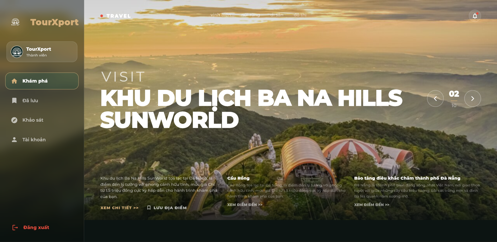
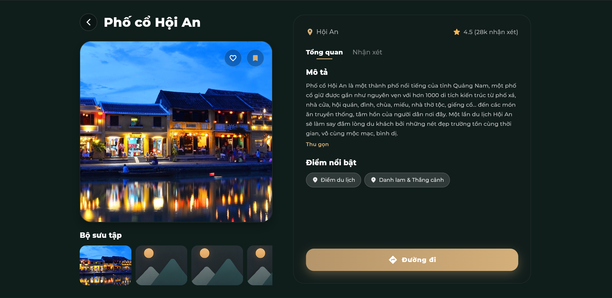
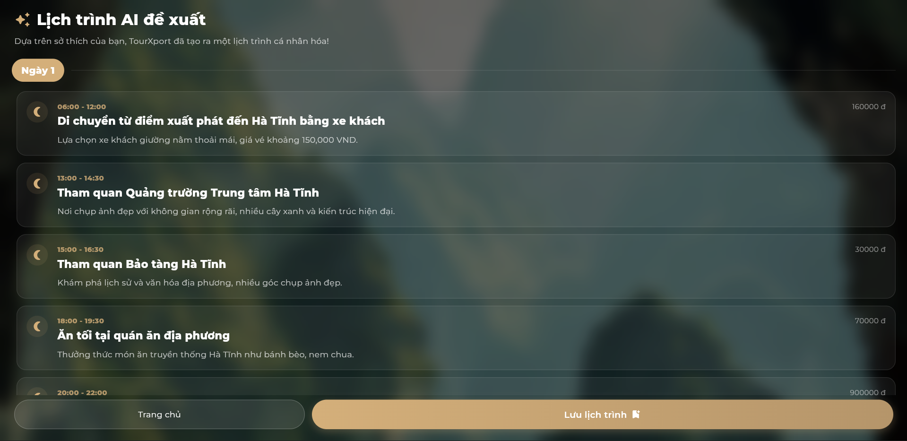
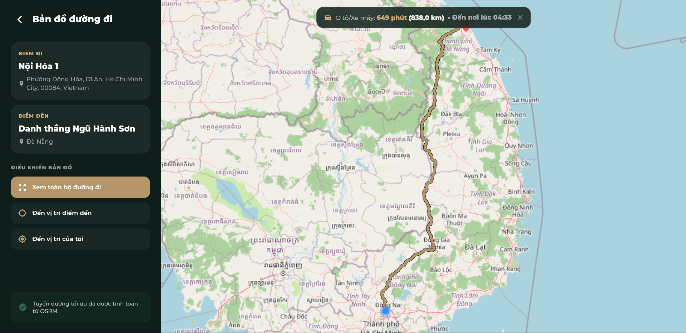
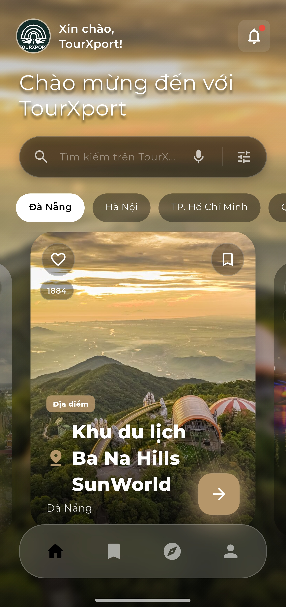
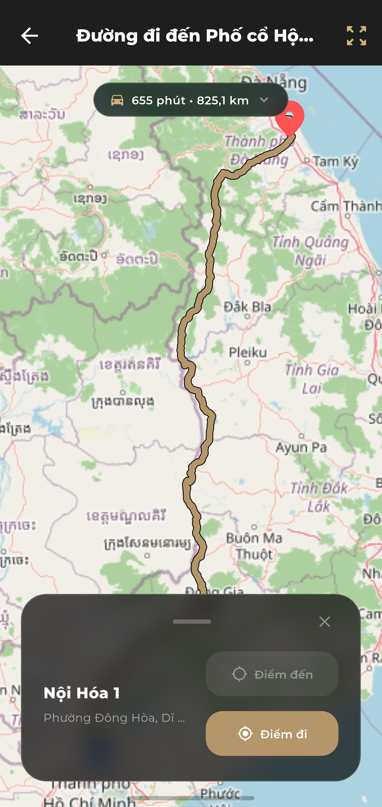
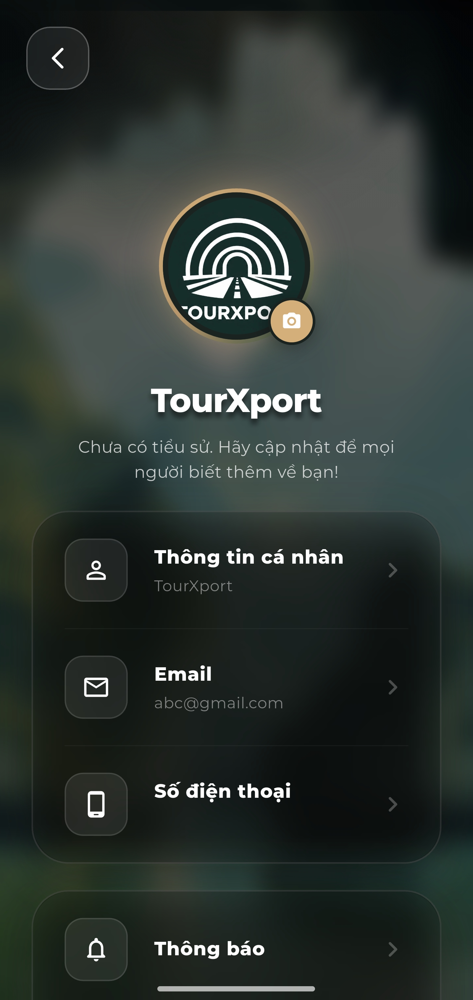

<p align="center">
  
</p>

<h1 align="center">TourXport</h1>

<p align="center">
  <a href="https://github.com/quocnam612/TourXport/stargazers"></a>
  <a href="https://github.com/quocnam612/TourXport/network/members"></a>
</p>

<p align="center">
  Một ứng dụng di động thông minh kết hợp Trí Tuệ Nhân Tạo (AI) để tự động hóa việc lập kế hoạch cho chuyến du lịch của bạn từ A-Z!
</p>

<p align="center">
  
  
  
  
</p>

<br>

<p align="center">
  <a href="https://github.com/quocnam612/TourXport/releases">
    
  </a>
  <a href="https://github.com/quocnam612/TourXport/releases">
    
  </a>
</p>

<p align="center">
  <strong>Nền Tảng Hỗ Trợ</strong><br>
  <a href="#"></a>
  <!-- <a href="#"></a> -->
  <a href="#"></a>
  <a href="#"></a>
  <a href="#"></a>
</p>

<br>

## Tổng Quan (Overview) 🌌

TourXport là một ứng dụng di động được xây dựng bằng **Flutter**, kết hợp với sức mạnh của **Trí Tuệ Nhân Tạo (AI)** để mang đến trải nghiệm lên lịch trình cá nhân hóa. Thay vì phải tốn hàng giờ tìm kiếm và sắp xếp các điểm đến, AI sẽ tự động phân tích sở thích, ngân sách và thời gian của bạn để đề xuất một lịch trình hoàn hảo.

Dự án này phục vụ như một trợ lý du lịch toàn diện dành cho môn học **Tư duy tính toán** tại **Trường Đại học Khoa học Tự nhiên, ĐHQG-HCM**.

> TourXport được thiết kế dành cho những người đam mê du lịch cần một công cụ lập kế hoạch nhanh chóng, thông minh và tiện lợi!

Điểm nổi bật:
- **Tự động hóa hoàn toàn** với Trợ lý AI.
- **Dữ liệu phong phú** từ hệ thống Crawler đa nguồn.
- **Trải nghiệm mượt mà** trên nền tảng Mobile & Web.

## Điểm khác biệt của TourXport ✨

Điểm cốt lõi của TourXport không phải là một công cụ tìm kiếm địa điểm thông thường, mà là **một hệ sinh thái du lịch trọn vẹn**. Từ việc gợi ý chuyến đi, lưu trữ thông tin, đến hệ thống bản đồ dẫn đường và quản lý cộng đồng đánh giá (Reviews).

Mọi quyết định thiết kế đều hướng tới việc giúp bạn có một lịch trình không chỉ khả thi, mà còn phù hợp nhất với phong cách cá nhân của bạn. Không cần phải lên mạng tra cứu từng nơi, TourXport tổng hợp tất cả vào một ứng dụng duy nhất.

## Tính Năng Cốt Lõi 🚀

Thay vì chỉ cung cấp một thanh tìm kiếm, ứng dụng hoạt động thông qua một chuỗi các hệ thống phối hợp với nhau. Dưới đây là các tính năng chính:

<table>
  <tr>
    <td width="50%" valign="top">
      <strong>🤖 Trợ lý AI Lập Lịch Trình</strong><br>
      Sử dụng thuật toán AI để thiết kế lịch trình cá nhân hóa dựa trên bảng khảo sát. Tự động sắp xếp khách sạn, nhà hàng và điểm tham quan.<br><br>
      <code>Cá Nhân Hóa</code> <code>Khảo sát</code> <code>Tự động sắp xếp</code>
    </td>
    <td width="50%" valign="top">
      <strong>🗺️ Bản Đồ Tương Tác</strong><br>
      Tích hợp hệ thống bản đồ (Map) giúp người dùng dễ dàng xem vị trí các địa điểm, tìm đường và theo dõi chuyến đi một cách trực quan nhất.<br><br>
      <code>Điều hướng</code> <code>Theo dõi vị trí</code> <code>Khám phá</code>
    </td>
  </tr>
  <tr>
    <td width="50%" valign="top">
      <strong>📍 Quản Lý & Lưu Trữ Tour</strong><br>
      Lưu lại các điểm đến yêu thích và xem lại chi tiết lịch trình các chuyến đi đã được AI tạo ra bất kỳ lúc nào.<br><br>
      <code>Bookmark</code> <code>Quản lý chuyến đi</code> <code>Ngoại tuyến</code>
    </td>
    <td width="50%" valign="top">
      <strong>⭐ Đánh Giá & Cộng Đồng</strong><br>
      Xem chi tiết thông tin địa điểm và tự do tạo đánh giá, chia sẻ trải nghiệm thực tế của bạn với cộng đồng người dùng TourXport.<br><br>
      <code>Review</code> <code>Chia sẻ</code> <code>Cộng đồng</code>
    </td>
  </tr>
</table>

## Giao Diện Ứng Dụng 🖼️

Giao diện được thiết kế trực quan, các đường nét hiện đại và được tối ưu hóa cho từng nền tảng thiết bị.

### Phiên Bản Web / Windows / Linux
Trải nghiệm màn hình lớn với đầy đủ thông tin, thao tác dễ dàng bằng chuột và bàn phím.

<table>
  <tr>
    <td align="center"></td>
  </tr>
  <tr>
    <td align="center"></td>
  </tr>
  <tr>
    <td align="center"></td>
  </tr>
  <tr>
    <td align="center"></td>
  </tr>
  <tr>
    <td align="center"></td>
  </tr>
</table>

### Phiên Bản Mobile
Tối ưu hóa thao tác cảm ứng, mang lại trải nghiệm mượt mà, tiện lợi dù bạn ở bất cứ đâu.

<table>
  <tr>
    <td width="33%" align="center"></td>
    <td width="34%" align="center"></td>
    <td width="33%" align="center"></td>
  </tr>
  <tr>
    <td width="33%" align="center"></td>
    <td width="34%" align="center"></td>
    <td width="33%" align="center"></td>
  </tr>
</table>

<p align="center">
  <a href="https://tourxport.vercel.app/">
    
  </a>
</p>

## Hướng Dẫn Sử Dụng 📱

TourXport hỗ trợ truy cập linh hoạt thông qua đa nền tảng. Dưới đây là hướng dẫn chi tiết cho từng nền tảng:

### 🌐 Trải Nghiệm Trên Web (Không cần cài đặt)
- **Bước 1:** Mở trình duyệt web yêu thích trên máy tính hoặc điện thoại của bạn.
- **Bước 2:** Truy cập trực tiếp vào đường dẫn: [https://tourxport.vercel.app/](https://tourxport.vercel.app/).
- **Bước 3:** Đăng nhập hoặc tạo tài khoản mới để bắt đầu tạo lịch trình cá nhân hóa ngay lập tức.

### 📲 Cài Đặt Trên Điện Thoại (Android)
- **Bước 1:** Truy cập vào mục [Releases](https://github.com/quocnam612/TourXport/releases) của Repository này.
- **Bước 2:** Tìm phiên bản phát hành mới nhất (Latest) và tải xuống file `.apk` (ví dụ: `TourXport-2.0.0.apk`) nằm trong phần **Assets**.
- **Bước 3:** Mở file `.apk` vừa tải về trên thiết bị Android của bạn. *(Lưu ý: Nếu hệ thống yêu cầu cấp quyền cài đặt ứng dụng từ nguồn không xác định, hãy nhấn **Cho phép**)*.
- **Bước 4:** Chờ quá trình cài đặt hoàn tất, mở ứng dụng **TourXport** và tận hưởng!

### 💻 Cài Đặt Trên Máy Tính (Windows)
- **Bước 1:** Truy cập vào mục [Releases](https://github.com/quocnam612/TourXport/releases) của Repository này.
- **Bước 2:** Tìm và tải xuống file nén dành cho Windows (ví dụ: `TourXport-Windows.zip`) nằm trong phần **Assets**.
- **Bước 3:** Giải nén toàn bộ nội dung file `.zip` vừa tải về vào một thư mục.
- **Bước 4:** Mở thư mục vừa giải nén, tìm và chạy file `frontend.exe` để khởi động ứng dụng.

### 🐧 Cài Đặt Trên Máy Tính (Linux)
- **Bước 1:** Truy cập vào mục [Releases](https://github.com/quocnam612/TourXport/releases) của Repository này.
- **Bước 2:** Tải xuống file nén dành cho Linux (ví dụ: `TourXport-x64Linux-2.0.0.zip`).
- **Bước 3:** Giải nén file `.zip` vừa tải về.
- **Bước 4:** Mở terminal tại thư mục vừa giải nén, cấp quyền thực thi cho file nếu cần (vd: `chmod +x TourXport-x64Linux-2.0.0`) và chạy file thực thi `./TourXport-x64Linux-2.0.0` để bắt đầu trải nghiệm.


## Kiến Trúc Hệ Thống 🧭

Hệ thống của TourXport được chia thành nhiều module riêng biệt đảm bảo hiệu năng và dễ dàng mở rộng:

<table>
  <tr>
    <td><strong>Thành Phần</strong></td>
    <td><strong>Trách Nhiệm (Responsibility)</strong></td>
  </tr>
  <tr>
    <td><code>Frontend (Flutter)</code></td>
    <td>Giao diện ứng dụng đa nền tảng (Android, <!-- iOS, --> Web). Chứa các màn hình, quản lý state và tương tác người dùng.</td>
  </tr>
  <tr>
    <td><code>Backend (Node.js)</code></td>
    <td>API server để quản lý tài khoản, dữ liệu chuyến đi, và định tuyến (routing) yêu cầu.</td>
  </tr>
  <tr>
    <td><code>AI Server (Python)</code></td>
    <td>Xử lý logic cốt lõi bằng AI để tạo ra lịch trình dựa trên yêu cầu người dùng.</td>
  </tr>
  <tr>
    <td><code>Crawler (Python)</code></td>
    <td>Hệ thống tự động thu thập và xử lý dữ liệu địa điểm, nhà hàng từ các nguồn bên ngoài.</td>
  </tr>
</table>

## Cài Đặt & Phát Triển 🛠️

Yêu cầu cài đặt sẵn: **Docker**, **Docker Compose**, **Flutter SDK** và cấu hình file `.env` (xem `.env.example`).

**Khởi động các dịch vụ backend:**
Tại thư mục gốc, chạy lệnh sau để khởi động Backend (Node.js) và AI Server (Python):
```bash
docker compose up backend --build
docker compose up ai_backend --build
```

**Khởi động Frontend (Flutter):**
Di chuyển vào thư mục `frontend` và chạy ứng dụng:
```bash
cd frontend
flutter run -d chrome  # Chạy trên trình duyệt Web
# hoặc
flutter run -d <YOUR_DEVICE_NAME>  # Chạy trên thiết bị di động
```

## Nguồn Dữ Liệu & Server Khác 🤖

TourXport hoạt động bằng cách thu thập dữ liệu công khai hoặc thông qua API ẩn. Frontend giao tiếp trực tiếp với Backend (Node.js) cho việc lưu trữ, trong khi các thuật toán tính toán phức tạp nhất được đẩy sang AI Server chạy trên môi trường Python. Điều này giúp chia tách rõ ràng giữa việc hiển thị UI mượt mà và xử lý AI nặng nề ở phía sau.

## Đóng Góp & Hỗ Trợ (Contributing) 🤝

Mọi đóng góp nhằm hoàn thiện TourXport đều được chào đón! Việc tối ưu bộ máy AI, thêm các nguồn crawl mới, hay cải thiện giao diện Flutter đều rất đáng quý. Nếu bạn tìm thấy bất kỳ lỗi nào, vui lòng mở **Issue** hoặc tạo **Pull Request** trên repository này.

## Cộng Đồng 💬

Dự án này được phát triển cho môn học **Tư duy tính toán** (Computational Thinking).

- **Dự án:** [github.com/quocnam612/TourXport](https://github.com/quocnam612/TourXport)
- **Nhóm Phát Triển:** Nhóm 2
- **Trường:** Đại học Khoa học Tự nhiên, ĐHQG-HCM

---

<p align="center">
  Made with 💜 by <strong>Nhóm 2</strong>
</p>